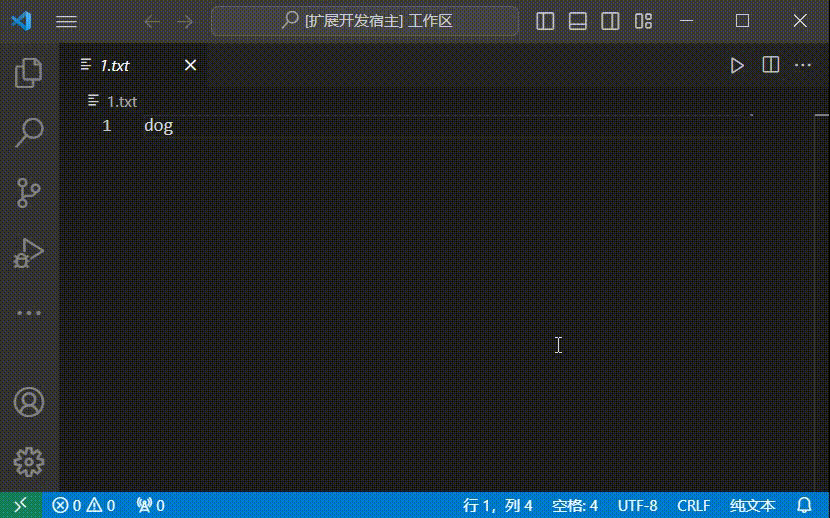

# cmdterminalmaker 说明文档

一个插件，配置后可以运行'new terminal and run'命令，创建终端并执行配置的命令。

## 功能



## 扩展设置

* `cmdterminalmaker.commands`: 用于配置 CMD Terminal Maker 的命令数组。每个命令是一个对象，包含以下属性：

  - `terminalName`（可选）: 终端名称。
  - `command`: 执行的命令。
  - `name`: 命令的名称。
  - `parameters`（可选）: 命令的参数，可以是一个对象或对象数组。

    - 对象参数包含以下属性：
      - `name`: 参数名称。
      - `default`（可选）: 参数的默认值。
      - `chosen`（可选）: 一个包含 `label` 和 `description` 的对象数组，用于在快速选择中选择参数值。
      - `placeHolder`（可选）: 输入框的占位符文本。

    - 数组参数包含以下属性：
      - `default`（可选）: 参数的默认值。
      - `placeHolder`（可选）: 输入框的占位符文本。

示例配置:

```json
"cmdterminalmaker.commands": [
        {
            "name": "Print Message",
            "command": "echo",
            "parameter": [
                {
                    "name": "message",
                    "placeHolder": "Enter your message"
                }
            ]
        },
        {
            "name": "Greet User",
            "command": "echo",
            "parameter": [
                {
                    "name": "greeting",
                    "chosen": [
                        {
                            "label": "Hello",
                            "description": "Standard greeting"
                        },
                        {
                            "label": "Hi",
                            "description": "Casual greeting"
                        },
                        {
                            "label": "Hola",
                            "description": "Spanish greeting"
                        }
                    ],
                    "placeHolder": "Choose a greeting"
                },
                {
                    "name": "name",
                    "placeHolder": "Enter your name"
                }
            ]
        },
        {
            "name": "List Files",
            "command": "ls"
        },
        {
            "name": "Display File Contents",
            "command": "cat",
            "parameter": [
                {
                    "name": "file",
                    "placeHolder": "Enter file name"
                }
            ]
        }
    ],
```

通过上述配置，你可以定义不同的命令及其参数，使得 CMD Terminal Maker 能够执行各种自定义命令。

## 发布说明

在更新扩展时，用户会感激发布说明。

### 1.0.0

初始版本...
